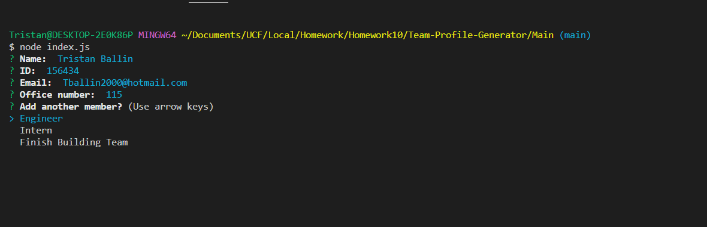
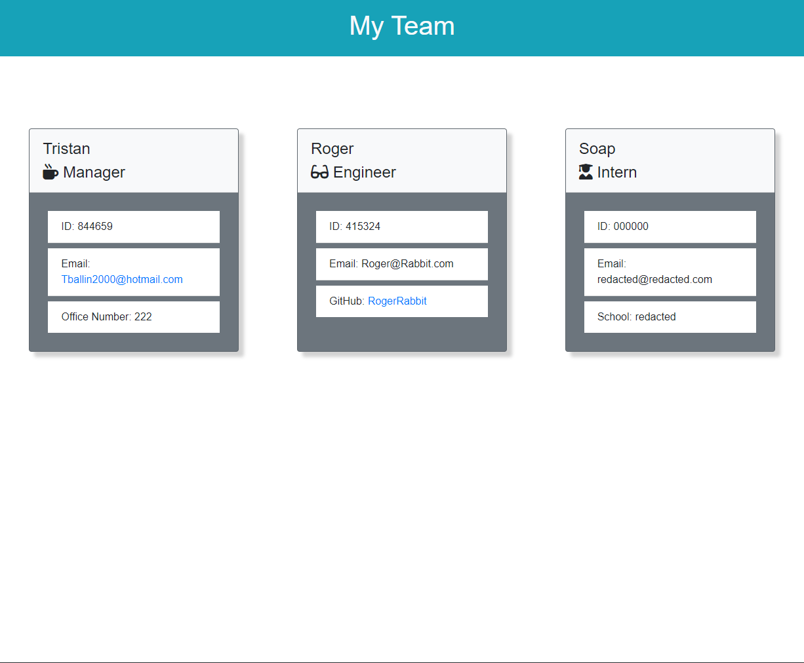

[](https://opensource.org/licenses/MIT)

# Team-Profile-Generator

## Description
This project uses NodeJS to create a website to easily see all of the team members for a specific team. The user is prompted in the console to input all of the information for the team and a HTML and CSS file will be generated in order to display that information on screen.

## Table of Contents
1. [Installation](#installation)
2. [Usage](#usage)
3. [Links](#links)
4. [Screenshots](#screenshots)
5. [License](#license)
6. [Questions](#questions)

## Installation
- Fork the repo down to your local machine
- Install modules by using `npm i` in your terminal
- Then youre good to go!

## Usage
Once installed, type `node index.js` in the terminal.
Input the information about the manager first.
Then input all of the team members information.
When you're done, select Finish Building Team to generate the files.
Then open the html file from the dist folder and you're good to go!

### User Story

```
AS A manager
I WANT to generate a webpage that displays my team's basic info
SO THAT I have quick access to their emails and GitHub profiles
```

### Acceptance Criteria

```
GIVEN a command-line application that accepts user input
WHEN I am prompted for my team members and their information
THEN an HTML file is generated that displays a nicely formatted team roster based on user input
WHEN I click on an email address in the HTML
THEN my default email program opens and populates the TO field of the email with the address
WHEN I click on the GitHub username
THEN that GitHub profile opens in a new tab
WHEN I start the application
THEN I am prompted to enter the team manager’s name, employee ID, email address, and office number
WHEN I enter the team manager’s name, employee ID, email address, and office number
THEN I am presented with a menu with the option to add an engineer or an intern or to finish building my team
WHEN I select the engineer option
THEN I am prompted to enter the engineer’s name, ID, email, and GitHub username, and I am taken back to the menu
WHEN I select the intern option
THEN I am prompted to enter the intern’s name, ID, email, and school, and I am taken back to the menu
WHEN I decide to finish building my team
THEN I exit the application, and the HTML is generated
```

## Links

[Dashboard Link](https://github.com/ThatBallinGuy/Team-Profile-Generator)

[Demo Link](https://drive.google.com/file/d/1Lp9uU5QDHwnOPf-AB9pOcJ6mQOBvXnGJ/view?usp=sharing)

## Screenshots



## License
Licensed under [MIT License](https://opensource.org/licenses/MIT)

## Questions
For any questions, contact me at:
- Github: [ThatBallinGuy](https://github.com/ThatBallinGuy)
- Email: Tballin2000@hotmail.com
  